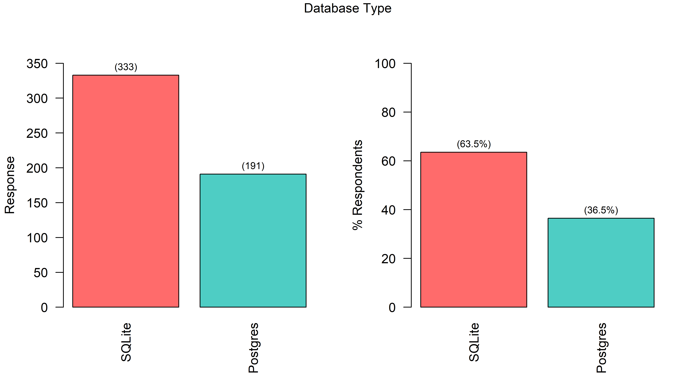
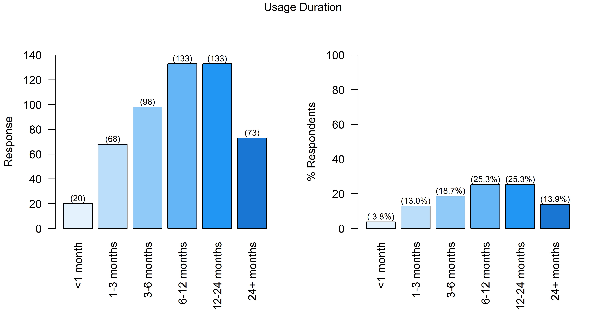
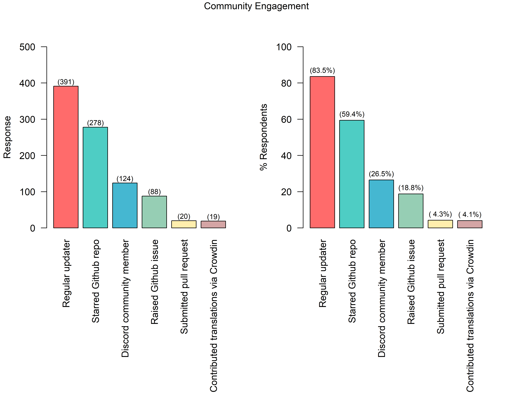
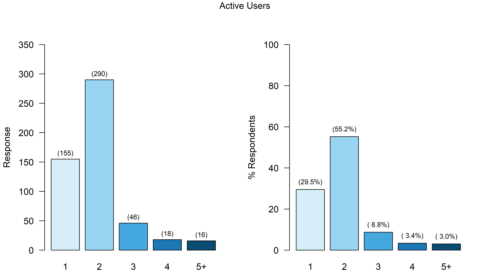
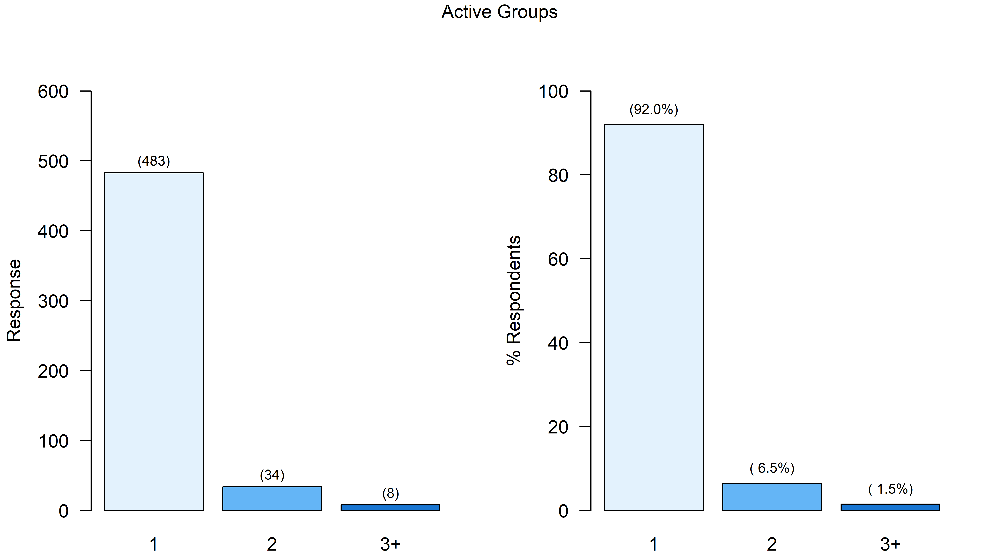
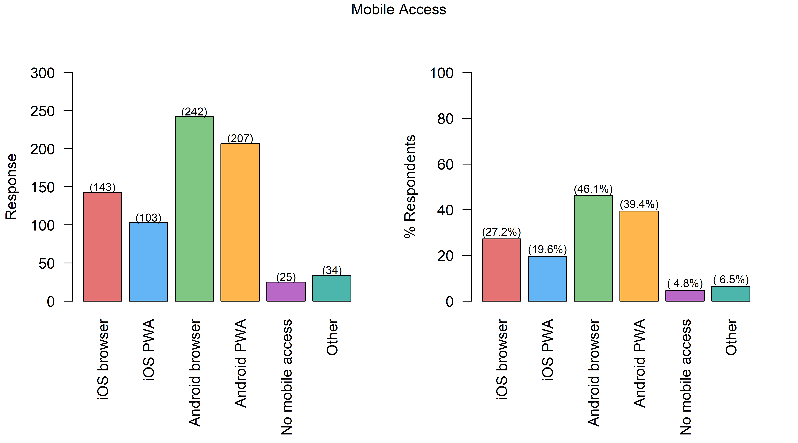
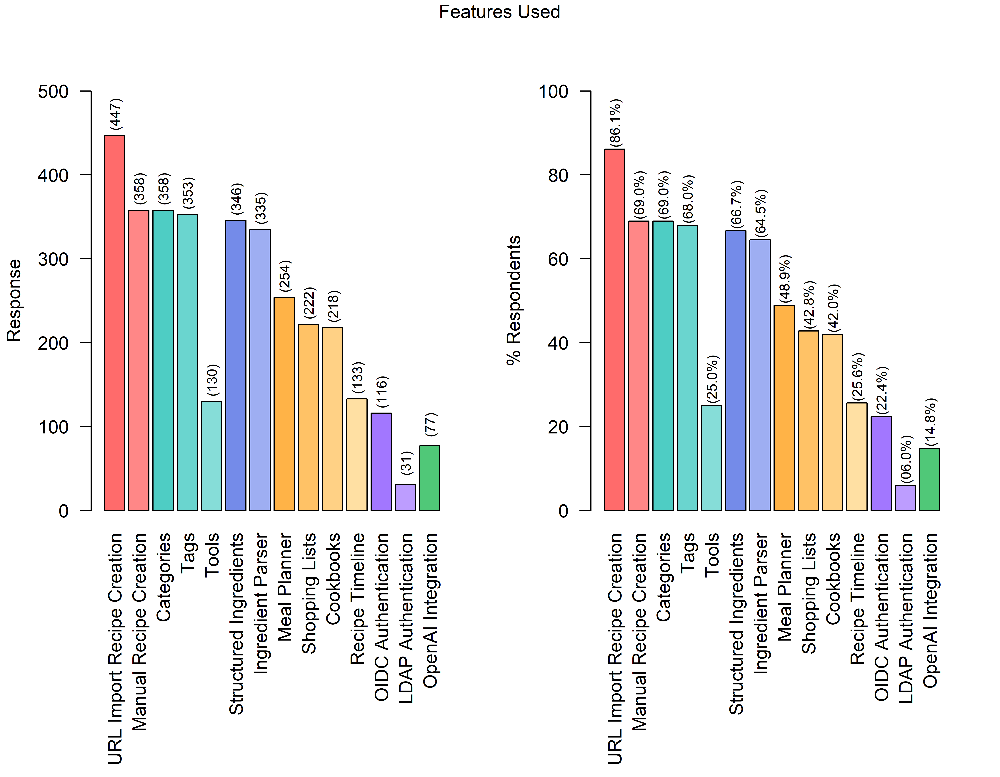

# October 2024 Survey

It's been a while since a Mealie survey was done, and the community was much smaller back then. So much has changed in 2024, and we wanted to gauge the community's thoughts.
Our v2.0 release gave us a platform to ask people to take a few minutes to share their thoughts.

A massive thanks to everyone who took the time to fill out this survey. We had 525 respondents! We're overwhelmed with the support.

Also, thanks to ChristianB-F from our Discord community for putting the following images together, and to everyone who has taken the time to raise either an issue or pull request on our GitHub repository!

For each question, we've created a GitHub discussion and we invite you to share any interesting insights or thoughts you have from the survey results!
If you see a specific idea that resonates with you, please check if there's already a feature request, and if not, please raise one and add your perspective.

The questions (bar question 1) that are free text are on separate pages you'll need to click into, as there's just too much content to include on this page.

For the written response sections, we have removed some of the more indifferent responses (e.g., "N/A") to save you reading time. If you'd like to see all the raw responses, they're in [this GitHub commit](https://github.com/mealie-recipes/mealie/pull/4666/commits/1287bc1635d9c2560b10db3a92a0d6644bc81571).

## Structured Questions

### Mealie Version (pre-v2)

This question was free text input and it was mandatory.

The responses to this were so varied and not overly informative/indicative of anything, so we've decided not to publish them - both to save space and your time.

### Database Type

This question was a single select and it was optional.

Key insight: SQLite is the predominant database, but Postgres maintains an admirable share and must remain front of mind for any changes we make.

[GitHub Discussion](https://github.com/mealie-recipes/mealie/discussions/4640)

### Time Using Mealie

How long have you been using Mealie? This question was a single select and it was mandatory.

Key insight: Most users have been using Mealie less than a year, with another 25% in the 1-2 year range. These users will have seen a lot of change in the product over that time.
Thanks to the long term users!

[GitHub Discussion](https://github.com/mealie-recipes/mealie/discussions/4641)

### Engagement with Mealie, the Project, and the Community

This question was multiple choice and it was optional.

[GitHub Discussion](https://github.com/mealie-recipes/mealie/discussions/4642)

### Number of Active Users

This question was a single select and it was mandatory.

Key insight: ~85% of instances have 2 users or fewer. This is assumed to be a couple of adults living together.

[GitHub Discussion](https://github.com/mealie-recipes/mealie/discussions/4643)

### Number of Active Groups

This question was a single select and it was mandatory.

Key insight: Similar to the above question, one group being the most common backs the theory of one "family" using the Mealie instance.

[GitHub Discussion](https://github.com/mealie-recipes/mealie/discussions/4644)

### Using Mealie on Mobile

Do you access Mealie on a mobile? Using your browser or with it installed as an app (a Progressive Web App/PWA)? This question was a multiple select and it was mandatory.

[GitHub Discussion](https://github.com/mealie-recipes/mealie/discussions/4645)

### Feature Usage

Please select all the features you actively/regularly use, or consider important. This question was a multiple select and it was optional.

[GitHub Discussion](https://github.com/mealie-recipes/mealie/discussions/4646)

## Suggestions/Feedback

Some of you will spot feature suggestions that you know to already exist in Mealie. We'd love it if you could help us improve the documentation so more people can know about them! All pull requests are much appreciated. The [features](https://docs.mealie.io/documentation/getting-started/features/) page, or the [FAQ](https://docs.mealie.io/documentation/getting-started/faq/) could be appropriate places to add documentation.

### Shopping List Suggestions

[GitHub Discussion](https://github.com/mealie-recipes/mealie/discussions/4647)

[Question 9](q9.md)

### Meal Planner Suggestions

[GitHub Discussion](https://github.com/mealie-recipes/mealie/discussions/4648)

[Question 10](q10.md)

### Recipe Timeline Suggestions

Key insight: Looks like a lot of people would be fine with this not existing, or at least being hidden.

[GitHub Discussion](https://github.com/mealie-recipes/mealie/discussions/4649)

[Question 11](q11.md)

### Recipe Suggestions

[GitHub Discussion](https://github.com/mealie-recipes/mealie/discussions/4650)

[Question 12](q12.md)

### Other Suggestions

There are so many kind words in this section in particular. Thanks so much, it means a lot to the whole team and all our contributors to see the impact Mealie has on people's lives!

[GitHub Discussion](https://github.com/mealie-recipes/mealie/discussions/4651)

[Question 13](q13.md)
